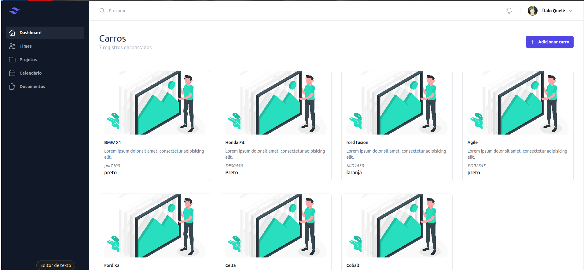

# CRUD Simples com Nodejs e Vuejs



## 🚀 Instalando

Para instalar o projeto, siga estas etapas:

Clone do repositório
```
git clone https://github.com/Italo-Tech/crud-car-nodejs.git
```
Instale as dependências
```
npm install
```
Build do server
```
npm run start
```
Build do projeto em outro terminal
```
npm run dev
```
